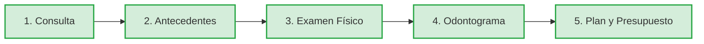
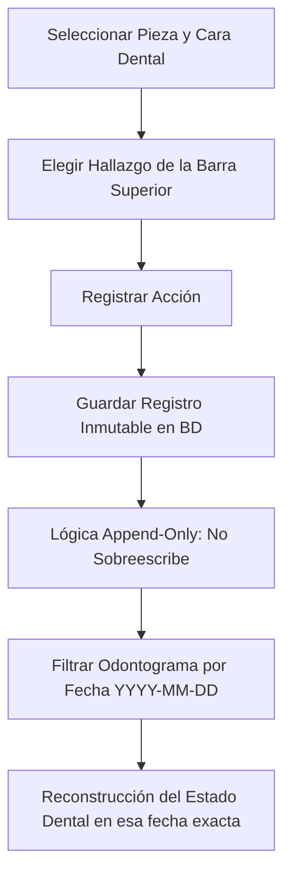

# 🏥 Manual de Usuario Clínico — VitalNexus

Bienvenido al **Manual de Usuario Clínico** de **VitalNexus**. Esta guía está diseñada para que tú, como especialista de la salud, puedas dominar el uso de la plataforma, optimizar tus tiempos de consulta, gestionar tus finanzas clínicas y automatizar la comunicación con tus pacientes.

---

## 📌 Tabla de Contenido
1. [Introducción y Filosofía del Sistema](#1-introducción-y-filosofía-del-sistema)
2. [Acceso, Sesión y Seguridad](#2-acceso-sesión-y-seguridad)
3. [Dashboard Principal: Tu Centro de Mando](#3-dashboard-principal-tu-centro-de-mando)
4. [Módulo de Pacientes](#4-módulo-de-pacientes)
5. [Agenda y Calendario de Citas (Motor de Rentabilidad)](#5-agenda-y-calendario-de-citas-motor-de-rentabilidad)
6. [Historia Clínica Modular (HC)](#6-historia-clínica-modular-hc)
7. [Odontograma Evolutivo 360° (Exclusivo Odontología)](#7-odontograma-evolutivo-360-exclusivo-odontología)
8. [Inventario de Insumos y Receta de Servicios](#8-inventario-de-insumos-y-receta-de-servicios)
9. [Presupuestos, Abonos y Recibos Digitales](#9-presupuestos-abonos-y-recibos-digitales)
10. [Portal Público de Reserva (Booking) y Configuración de Perfil](#10-portal-público-de-reserva-booking-y-configuración-de-perfil)

---

## 1. Introducción y Filosofía del Sistema

VitalNexus no es solo un gestor de expedientes; es un ecosistema SaaS diseñado bajo dos pilares técnicos fundamentales que benefician directamente tu práctica profesional:

*   **Aislamiento y Confidencialidad Absoluta (Multi-tenancy con RLS):** A diferencia de otros sistemas donde los datos de todos los médicos están mezclados y expuestos a filtraciones, VitalNexus implementa **Row Level Security (RLS)** a nivel de base de datos. Ningún otro especialista podrá jamás visualizar tus pacientes, historias clínicas, insumos o facturación. Tus datos están blindados de forma nativa.
*   **Identificadores Criptográficos (UUID):** Todos los registros utilizan claves únicas no secuenciales (UUID v4). Esto previene que terceros adivinen la cantidad de pacientes que tienes o intercepten datos mediante la edición de URLs en el navegador.

---

## 2. Acceso, Sesión y Seguridad

### 2.1 Registro e Inicio de Sesión
Para acceder al sistema debes ingresar tus credenciales de especialista en la pantalla de acceso. 


*(Espacio para captura de pantalla de inicio de sesión)*

### 2.2 Control de Inactividad y Caducidad de Sesión
Por regulaciones de confidencialidad médica, tu sesión cuenta con un **sistema de expiración por inactividad de 55 minutos**. 
* Si dejas de interactuar con el sistema durante ese lapso, aparecerá un banner de advertencia visual en pantalla con una cuenta regresiva.
* Si el contador llega a cero, el sistema cerrará sesión de forma automática y te redirigirá a la pantalla de Login, protegiendo los datos del paciente si te alejas de tu computadora.

### 2.3 Autogestión de Seguridad (Rotación de Claves)
Cada doctor tiene el control total sobre la seguridad de su cuenta:
1. Dirígete a **Configuración** (icono de engranaje) -> pestaña **Seguridad**.
2. Podrás cambiar tu contraseña utilizando políticas estrictas de validación (mayúsculas, minúsculas, números y caracteres especiales) con un indicador visual animado de fortaleza de clave.
3. Activa la **Rotación Obligatoria de Claves** definiendo cada cuántos días deseas que el sistema te exija cambiar tu contraseña.

---

## 3. Dashboard Principal: Tu Centro de Mando

Al iniciar sesión, ingresarás al **Dashboard del Especialista**. Este panel te da una vista analítica en tiempo real de tu día de trabajo y salud financiera.

```
+-----------------------------------------------------------------------------------+
|  [VITALNEXUS]                                                   (Dr. Juan Pérez)  |
+-----------------------------------------------------------------------------------+
|  +-------------------+  +-------------------+  +-------------------+  +---------+ |
|  | PACIENTES ACTIVOS |  |   CITAS DE HOY    |  | INGRESOS DEL MES  |  | STOCK   | |
|  |       1,240       |  |         8         |  |     €2,450.00     |  | ALERTA  | |
|  |    (+4.5% MoM)    |  |  (3 completadas)  |  |    (+12% vs EUR)  |  | 3 crit. | |
|  +-------------------+  +-------------------+  +-------------------+  +---------+ |
|                                                                                   |
|  +-----------------------------------------+  +---------------------------------+ |
|  | AGENDA DE HOY                           |  | PACIENTES RECIENTES             | |
|  | - 09:00: Ana Gómez (Limpieza)      [OK] |  | - Ana Gómez     (Ver Historia)  | |
|  | - 10:30: Carlos Ruiz (Endodoncia)  [  ] |  | - Pedro Infante (Ver Historia)  | |
|  | - 12:00: Luisa M. (Consulta Gral)  [  ] |  | - Maria Delgado (Ver Historia)  | |
|  +-----------------------------------------+  +---------------------------------+ |
+-----------------------------------------------------------------------------------+
```

### KPIs Destacados:
*   **Pacientes Activos:** Número de pacientes únicos bajo tu cuidado, con indicador de crecimiento respecto al mes anterior (MoM).
*   **Citas de Hoy:** Resumen del volumen diario y avance de las mismas.
*   **Ingresos del Mes:** Sumatorio de abonos recolectados convertidos en tiempo real.
*   **Alertas de Stock:** Te avisa instantáneamente si tienes materiales médicos por debajo del inventario mínimo establecido.

---

## 4. Módulo de Pacientes

La base de datos de pacientes está diseñada para una carga rápida de información sin perder la rigidez de los datos médicos.

### 4.1 Registro de Paciente
1. Haz clic en **Pacientes** -> **Nuevo Paciente**.
2. Completa los datos requeridos. El sistema incluye máscaras de entrada automáticas:
    *   **Cédula:** Formato estricto venezolano (ej: `V-12345678` o `E-87654321`).
    *   **Teléfono:** Formato estricto con código internacional (ej: `+58 412-1234567`).
3. El sistema valida en tiempo real que el paciente no esté duplicado por número de identificación.

### 4.2 Línea de Tiempo Clínica
Al abrir el perfil de un paciente, verás una **Línea de Tiempo Interactiva**. Esta pantalla ordena cronológicamente todas las atenciones, presupuestos, notas y archivos del paciente.

```
(Hoy) ---------------- [ CITA COMPLETADA ] - Dr. Juan Pérez
                              |-> Diagnóstico: Caries oclusal en pieza 46
                              |-> Tratamiento: Resina fotocurada
                              
(20/05/2026) ---------- [ ABONO REGISTRADO ] - Pago de €150.00 (Bs. 6,150.00)
                              |-> Presupuesto #1024 - Saldo pendiente: €50.00
                              
(15/05/2026) ---------- [ ARCHIVO ADJUNTO ] - Radiografía Panorámica
                              |-> [Ver Online]  |  [Descargar Archivo]
```

### 4.3 Visualización y Descarga Segura de Archivos
*   **Botón Ver (Inline):** Abre imágenes de radiografías, exámenes de laboratorio o informes directamente en una nueva pestaña del navegador sin forzar la descarga.
*   **Botón Descargar:** Guarda el archivo localmente en tu dispositivo.
*   **Seguridad:** Los enlaces de los archivos están protegidos mediante tokens dinámicos vinculados a tu JWT. Ningún usuario no autorizado puede acceder a las imágenes médicas compartiendo el link de descarga.

---

## 5. Agenda y Calendario de Citas (Motor de Rentabilidad)

La agenda te permite planificar la consulta diaria e integra de manera invisible el motor financiero del consultorio.


*(Espacio para captura de pantalla del calendario de citas)*

### 5.1 Programación de una Cita
1. Ve a la pestaña **Citas** (se abre el calendario). Puedes visualizarlo por Semana o Mes.
2. Haz clic en el día y la hora deseada.
3. Selecciona el **Paciente**, el **Servicio** que se va a realizar, y la duración estimada.
4. Guarda la cita. El sistema la creará en estado `Programada` (color azul).

### 5.2 Estados de Cita
*   `Programada`: Cita agendada.
*   `Confirmada`: El paciente ratificó su asistencia (dispara flujo visual de preparación).
*   `Completada`: El paciente fue atendido. **Al marcar la cita como completada:**
    * El sistema deduce automáticamente los insumos utilizados de tu inventario.
    * Calcula la utilidad neta de la cita (Precio del servicio - Costo de insumos de la receta).
*   `Cancelada`: Libera el espacio en el calendario de inmediato.

---

## 6. Historia Clínica Modular (HC)

VitalNexus se adapta a diferentes ramas de la medicina mediante su **Motor de Secciones Dinámicas**. Cuando abres el expediente de un paciente, el sistema detecta tu especialidad y carga únicamente los pasos que requieres en tu consulta.

### 6.1 Flujo General de Historia Clínica (Ejemplo: Odontología)
El modal clínico se organiza en 5 pasos dinámicos:



1.  **Consulta:** Motivo y enfermedad actual.
2.  **Antecedentes:** Alergias, patologías sistémicas, antecedentes quirúrgicos, hábitos.
3.  **Examen Físico:** Toma de signos vitales (presión, frecuencia, temperatura, peso, IMC automático).
4.  **Odontograma / Módulo de Especialidad:** Visualización dental evolutiva en Iframe de pantalla completa.
5.  **Plan:** Diagnóstico final y plan de tratamiento detallado.

### 6.2 Alertas Médicas Destacadas (Sincronización Inteligente)
El sistema cuenta con un **sistema de alertas de alto impacto visual** en la cabecera del expediente. Si el paciente sufre de condiciones críticas (Alergias severas, Asma, Diabetes, Hipertensión), estas aparecerán en banners rojos parpadeantes.
* **Sincronización Bidireccional:** Al rellenar la sección de "Antecedentes" en tu primer paso clínico, marcar afecciones como "Asma" o "Diabetes" encenderá automáticamente los banners de alerta en todas las pantallas futuras del paciente.

### 6.3 Clonación de Evoluciones (Botón "Copiar Última")
Para evitar reescribir descripciones repetitivas en pacientes con tratamientos recurrentes (ej: ortodoncia, curas sucesivas):
1. Al abrir la creación de una nueva evolución, haz clic en el botón **"Copiar Última"**.
2. El sistema traerá automáticamente el diagnóstico, notas y plan del día anterior para que solo edites los cambios específicos del día de hoy.

---

## 7. Odontograma Evolutivo 360° (Exclusivo Odontología)

El Odontograma es una de las herramientas más potentes del sistema. Utiliza la nomenclatura internacional **FDI** dividida en cuadrantes para permanentes y temporales.



### 7.1 Filosofía Evolutiva (Lógica Append-Only)
A diferencia de otros odontogramas que sobrescriben el dibujo del diente y borran lo anterior, VitalNexus **nunca edita o borra**. Cada cambio inserta una nueva línea con su respectiva fecha.
* **Beneficio:** Cuenta con una barra de filtro por fecha. Puedes retroceder el odontograma a "hace 6 meses" o a la "fecha de ingreso" para mostrarle gráficamente al paciente cómo ha evolucionado su boca gracias al tratamiento.

### 7.2 Cómo Registrar un Hallazgo
1. Selecciona la pieza dental haciendo clic en ella.
2. La barra horizontal sobre el odontograma contiene los hallazgos agrupados en tres categorías:
    *   **Patologías (Rojo):** Caries, fracturas, piezas ausentes, movilidad.
    *   **Restauraciones (Azul):** Amalgama, resina, corona, puente, implante.
    *   **Estados (Verde/Amarillo):** Erupción, endodoncia, ortodoncia.
3. El sistema activará el "Modo Registro" con un banner animado. Selecciona la cara del diente afectada (Oclusal, Mesial, Distal, Vestibular, Lingual/Palatina, Radicular) y el sistema guardará el registro instantáneamente pintando la zona con el color correspondiente.

### 7.3 Modo Pantalla Completa
* Si tu pantalla es pequeña o estás en una tablet, haz clic en **"Abrir pantalla completa"**.
* El sistema abrirá la ruta `/embed/odontograma` en una pestaña limpia, ocultando el menú lateral del software para darte la mayor área de dibujo posible.

---

## 8. Inventario de Insumos y Receta de Servicios

Para tener un cálculo exacto de la rentabilidad de tu negocio, VitalNexus relaciona lo que cobras con lo que gastas en materiales.

### 8.1 Registro de Insumos
1. Ve a **Inventario** -> **Insumos**.
2. Registra tus materiales (ej: Anestesia, Resina, Agujas, Guantes).
3. Configura el **Costo Unitario** y el **Stock Mínimo**.
4. Si el stock desciende del mínimo, el dashboard te mostrará una alerta para que hagas el pedido antes de quedarte sin stock.

### 8.2 Creación de Receta de Servicios
Cada servicio que ofreces tiene una "receta" asociada:
1. Ve a **Configuración de Servicios**.
2. Selecciona un servicio (ej: *Resina en Diente Simple*).
3. Haz clic en **Editar Receta** y asocia los materiales e insumos que consumes en dicho procedimiento con sus cantidades exactas (ej: *0.25 tubos de anestesia, 1 punta de resina, 1 par de guantes*).
4. El sistema calculará la **Suma de Costos de Insumos** automáticamente.

---

## 9. Presupuestos, Abonos y Recibos Digitales

### 9.1 Presupuestos Multimoneda (Tasa BCV)
El motor de presupuestos calcula automáticamente los montos y los vincula a la tasa oficial del **Banco Central de Venezuela (BCV)** tomando el **Euro** como referencia principal e informando en **Dólares**:
* Al añadir servicios, el sistema recalcula los subtotales y totales al instante mediante triggers automáticos en la base de datos.
* El presupuesto se muestra en **Euros (EUR)** y realiza la conversión exacta a **Bolívares (Bs.)** basándose en la tasa BCV del día, protegiendo tus presupuestos de la devaluación.

### 9.2 Registro de Abonos (Planes de Pago)
Si el paciente decide pagar su tratamiento en cuotas:
1. Abre el presupuesto del paciente.
2. Haz clic en **Registrar Abono**.
3. Ingresa el monto (en EUR o su equivalente en Bs. pagados) y el método de pago (Pago Móvil, Transferencia, Efectivo).
4. Al guardar el abono:
    * El trigger en la base de datos se activa y **descuenta inmediatamente el saldo pendiente del presupuesto**.
    * Si el saldo llega a cero, el estado del presupuesto cambia automáticamente a `Pagado`.
    * Se registra la transacción en la línea de tiempo del paciente.

### 9.3 Compartir Presupuestos y Recibos Digitales Premium
*   **Compartir Presupuesto:** Puedes generar un enlace público único de su presupuesto y enviarlo vía WhatsApp. El paciente abrirá una vista digital con diseño premium libre de datos internos, optimizada para móviles, donde podrá ver su plan de pagos y el saldo pendiente. También cuenta con un botón para **Exportar a PDF**.
*   **Recibos de Abonos:** Al registrar un abono, se genera un enlace a un recibo digital premium interactivo que cuenta con el logo de tu clínica, dirección y métodos de contacto, sirviendo como comprobante de pago oficial.

---

## 10. Portal Público de Reserva (Booking) y Configuración de Perfil

VitalNexus te ayuda a captar nuevos pacientes a través de internet de manera autónoma.

### 10.1 Configuración de tu Identidad Digital
1. Dirígete a **Configuración** -> **Mi Perfil / Clínica**.
2. Completa tu biografía corta y carga tu **Foto de Perfil**.
3. En la pestaña **Identidad Clínica**, sube el **Logotipo de tu Clínica** y rellena los datos físicos (dirección, teléfonos).
4. En **Redes Sociales**, introduce tus links de Instagram, Facebook, TikTok y WhatsApp.

### 10.2 Tu Portal de Reservas Público
El sistema genera de forma automática una URL pública para ti: `/p/[nombre-especialista]` (ej: `/p/juan-perez`).


*(Espacio para captura de pantalla del portal público)*

#### Características del Portal Público:
*   **Diseño Premium:** Los pacientes verán tu foto, biografía, redes sociales con hover interactivo y el logotipo de tu clínica.
*   **Privacidad de Precios:** Cuentas con un interruptor en la configuración para ocultar o mostrar los precios de tus servicios en la web pública según tu estrategia comercial.
*   **Reserva Autónoma de Citas:** Los pacientes pueden ver qué días y horas tienes libres en tu agenda y agendarse solos. Si es un paciente nuevo, el portal le pedirá sus datos de contacto y **lo registrará automáticamente en tu base de datos de pacientes**, creando la cita en tu calendario con estado `Pendiente de Confirmación`.
